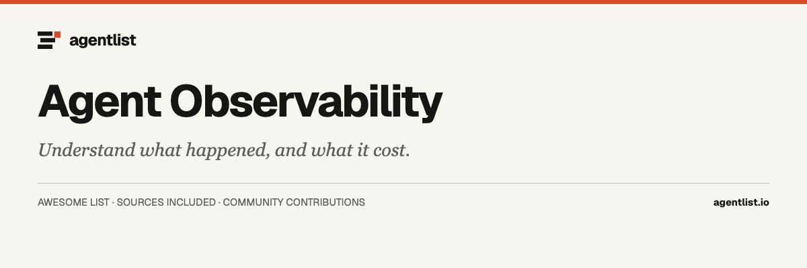

  

# Awesome Agent Observability

  

> Agent tracing, evaluation, session inspection, cost tracking, and OpenTelemetry instrumentation.

37 projects · Upstream documentation checked 2026-09-30. Curated by [agentlist.io](https://www.agentlist.io).

**Understand what your agent did, and whether it helped.**

Start with the question you cannot answer today: why a run failed, where the cost went, which tool call caused trouble, or whether a change improved the result. Traces, evaluations, and cost reports answer different questions. Choose the evidence you need before choosing a dashboard.

Tools for inspecting agent behavior, measuring usage, or evaluating outcomes. Tracing backends, instrumentation libraries, local session tools, and evaluation frameworks are distinct categories; one does not automatically replace another.

## Contents

- [How to choose](#how-to-choose)
- [Decision table](#decision-table)
- [Tracing and evaluation platforms](#tracing-and-evaluation-platforms)
- [Instrumentation](#instrumentation)
- [Usage and gateway monitoring](#usage-and-gateway-monitoring)
- [Evaluation and regression checks](#evaluation-and-regression-checks)
- [Local session inspection](#local-session-inspection)
- [Related awesome lists](#related-awesome-lists)
- [More from Agentlist](#more-from-agentlist)
- [Contributing](#contributing)

## How to choose

- Works with: Does it capture your agent framework, model calls, and tools? Can you instrument custom steps and export standard telemetry?
- Runs where: Where are traces stored and evaluations executed? Which features are available when self-hosted?
- Needs access to: Will prompts, outputs, files, or credentials appear in telemetry? What redaction and access controls can you configure?
- Keeps what: Can you retain and export traces, datasets, evaluation results, and cost records? What are the retention boundaries?
- Human involvement: Can you follow a failed run, review examples, and turn findings into regression checks? Who reviews automated evaluation judgments?
- Main limitation: Which steps or costs remain invisible? A successful request, a low bill, and a useful task outcome are different measurements.

Use these questions to narrow your shortlist. An entry’s source link records the documentation used for its description; it does not mean every question above has been answered or tested. Treat undocumented capabilities as unknown, and confirm requirements against the linked project before adopting it.

## Decision table

Rows are situations a cited page can separate. A project missing from a row is still in the catalog below. Unresolved means the cited page does not say.

| When you need | Documented fit | What the docs separate | Unresolved | Source |
| --- | --- | --- | --- | --- |
| Does adding a client library also choose where traces are stored? | Braintrust stores traces in its data plane. Logfire's SDK can export spans to any OpenTelemetry backend instead. | A hosted product is the system of record. An SDK that only emits spans leaves retention, access, and redaction to the backend you select. | Unknown which Logfire span fields remain when you export to a backend other than the Logfire service. | [source](https://github.com/pydantic/logfire) |
| If the Braintrust data plane is mine, what does Braintrust still operate? | Braintrust always operates the control plane. The data plane may be SaaS, BYOC, or self-hosted. | The control plane is UI, auth, and org metadata. The data plane holds traces and prompts. On the self-host architecture page, org-level LLM provider secrets stay on the control plane and project-level secrets stay on the data plane. | Unknown whether the SaaS deployment stores org-level provider secrets the same way; that split was read on the self-host architecture page. | [source](https://www.braintrust.dev/docs/admin/self-hosting/architecture) |
| Can I offer Phoenix itself as a hosted or managed service? | Phoenix is the self-hosted trace app. Managed workflows are a separate product, not this repository. | The LICENSE file is Elastic License 2.0, not an OSI license, and it bars providing the software to third parties as a hosted or managed service. | Unknown which Phoenix features are behind the license-key functionality that the same LICENSE text says not to circumvent. | [source](https://github.com/Arize-ai/phoenix/blob/main/LICENSE) |
| Is the whole Langfuse repository under one MIT license? | Langfuse is the trace platform. Only content outside the ee trees is MIT Expat. | The LICENSE file puts ee/, web/src/ee/, and worker/src/ee/ under ee/LICENSE. Calling the whole checkout MIT would overstate that grant. | Unknown which product features live only in the ee trees. The LICENSE file does not state retention. | [source](https://github.com/langfuse/langfuse/blob/main/LICENSE) |
| Does Helicone see the prompt, or only a span exported later? | Helicone's gateway receives the chat request. OpenLLMetry is listed there as a separate async logging path. | The quick start sets an OpenAI client base URL to the Helicone gateway, so that request passes through the proxy. Async OpenLLMetry logging is a different integration, not proof of a trace store you run. | Unknown whether the async logging path omits prompt text that the gateway receives, and the README does not state retention. | [source](https://github.com/Helicone/helicone) |
| Does a local cost report say the agent task succeeded? | ccusage reads local coding-agent usage files and prints token and cost reports. | Daily, weekly, monthly, and session reports are usage measurements. A completed request or a low total is not a judgment that the task helped. | Unknown whether any supported source log contains a task-success field. The README documents tokens, cost, and JSON output, not outcome scores. | [source](https://raw.githubusercontent.com/ccusage/ccusage/main/apps/ccusage/README.md) |
| Does an evaluation library keep the production trace? | Inspect scores prompts, tools, and dialog. Langfuse and Phoenix are separate trace stores. | Inspect is a Python evaluation framework. Its README does not document a trace store, so a model-graded score is not a retained production session. | Unknown where Inspect writes eval logs, how long they are kept, and whether Inspect drives a production agent rather than the eval you start. | [source](https://github.com/UKGovernmentBEIS/inspect_ai) |
| Which retention window is stated, and which is not? | Braintrust states Starter and Pro windows. Pezzo and Inspect do not on the pages read today. | Starter keeps logs and playground data 14 days and cannot extend that. Pro starts at 30 days and can extend it to 180. A missing number is not the same as keeping data forever. | Unknown how a self-hosted bucket policy interacts with these windows. This page does not state Pezzo or Inspect retention or where those tools store logs. | [source](https://www.braintrust.dev/docs/admin/data-management/retention) |
| Does Latitude's 30-day retention apply when I self-host? | Latitude states 30-day retention in the hosted quick start, not in the self-host section. | The 30-day figure is next to signup for the hosted service. Container-image and Helm self-host instructions do not restate a retention period. | Unknown what a self-hosted Latitude install keeps, and whether the hosted 30-day window can be extended. | [source](https://github.com/latitude-dev/latitude-llm) |
| Does AgentsView only read sessions, or can it start the agent? | AgentsView syncs local coding-agent sessions into SQLite. It is not itself the agent. | The usual server reads existing session files and serves a loopback UI. A separate capture run command can start one non-interactive claude -p or codex exec and does not start the daemon. | Unknown how long the local SQLite archive is kept, and which of the many named agents yield only partial transcripts. | [source](https://github.com/kenn-io/agentsview) |
| Does Claude Code Agent Monitor only watch sessions? | Claude Code Agent Monitor reads Claude Code, Cursor, and Codex activity into local SQLite. | Hooks and local transcripts feed an Express server at data/dashboard.db. The README also documents an HTTP API that can spawn claude subprocesses, so it is not only a viewer. | Unknown how long data/dashboard.db is kept, and whether that run API can start Cursor or Codex as well as claude. | [source](https://github.com/hoangsonww/Claude-Code-Agent-Monitor) |
| Is the Logfire UI part of the open-source repository? | Logfire in this catalog is the Python SDK. The platform UI and backend are not in this repo. | The README says the server application is closed source, the SDKs can export to any OpenTelemetry backend, and self-hosting that platform requires a purchased enterprise license. | Unknown which fields the closed-source UI stores or redacts. The README does not state retention. | [source](https://github.com/pydantic/logfire) |

## Tracing and evaluation platforms

- [AgentOps](https://github.com/AgentOps-AI/agentops) - Python SDK, plus an app directory, for session traces, replays, and LLM cost tracking. The README names CrewAI, AG2 (AutoGen), Agno, LangGraph, the OpenAI Agents SDK, and CAMEL, and the GitHub description also names LangChain; sessions show on a dashboard after an API key, and the README says the dashboard and API can be self-hosted under the MIT license, but it does not say where a hosted account stores data. **Python SDK and app.**
- [Langfuse](https://github.com/langfuse/langfuse) - Platform for LLM traces, prompt versions, datasets, and evaluations, including LLM-as-a-judge, code evaluators, user feedback, and manual labels. The README documents Langfuse Cloud and self-hosting with Docker Compose, a VM, or Helm, with Python and JS/TS SDKs and integrations such as OpenAI, LangChain, LlamaIndex, CrewAI, and AutoGen, and the LICENSE file says content outside ee/, web/src/ee/, and worker/src/ee/ is MIT Expat while those trees have their own license and no retention limit is stated. **Self-hosted or cloud.**
- [LangSmith](https://docs.langchain.com/langsmith/observability) - Product for traces, datasets, and evaluation. The docs say it can run as cloud, hybrid, or self-hosted, and that people can annotate traces. The open repository langchain-ai/langsmith-sdk is the client SDK, listed separately, not the server; retention limits for each deployment mode were not re-read beyond the platform-setup note. **Tracing platform.**
- [LangSmith SDK](https://github.com/langchain-ai/langsmith-sdk) - This repository is the Python and JavaScript client for the LangSmith platform, not the server. The README says you set an API key and workspace id, then wrap clients such as OpenAI or mark functions so traces and evaluation calls go to LangSmith, including a native path for LangChain in Python and JavaScript. It does not document retention, deployment mode, or where the platform stores prompts; those belong to the product, which is listed separately. **Platform SDK.**
- [Braintrust](https://www.braintrust.dev/docs) - Tracing and evaluation product whose docs keep a Braintrust-operated control plane separate from a data plane that can be SaaS, BYOC, or self-hosted, with BYOC and self-hosted requiring Enterprise. Starter keeps logs and playground data for 14 days and cannot extend that window, Pro starts at 30 days and can extend it to 180, the self-host architecture page stores org-level LLM provider secrets on the control plane, and github.com/braintrustdata/braintrust returned HTTP 404 on 2026-09-30 so this note does not treat that URL as a cloneable server. **Tracing platform.**
- [Opik](https://github.com/comet-ml/opik) - Platform for agent and LLM traces, datasets, experiments, prompt playground runs, and evaluations, including human feedback scores and LLM-as-a-judge checks. The README says the server, web app, and those core pieces are Apache-2.0 and can be self-hosted, and the client can also be configured against Opik Cloud, with annotation in the UI or Python SDK and a pytest hook for CI. The fetched README does not state retention limits. **Self-hosted or cloud.**
- [Phoenix](https://github.com/Arize-ai/phoenix) - Self-hosted app for OpenTelemetry traces, datasets, experiments, prompt versions, and evaluations. The README says you run Phoenix yourself, locally or in your own container or cloud account, and that managed workflows are a separate product, Arize AX, using the same OpenInference instrumentation; the LICENSE file is Elastic License 2.0, which is not an OSI license and bars offering this software as a hosted or managed service, and the fetched README does not state a retention schedule. **Self-hosted platform.**
- [Weave](https://github.com/wandb/weave) - Weights & Biases Python toolkit for tracing functions and evaluating language-model apps. The README says you need a Weights & Biases account, call weave.init with a project name, and decorate functions so inputs, outputs, and traces are logged to that service. It does not document a self-hosted Weave server in this repository, and older Weave engine code is described as paused while the project focuses on tracing and evaluations. **Python toolkit.**
- [Laminar](https://github.com/lmnr-ai/lmnr) - Observability platform for agent traces, plain-language behavior signals, annotation, datasets, and evaluations, with SQL over span data. The README documents a managed service and a Docker Compose self-host, and it says the SDK is OpenTelemetry-native for libraries such as the Vercel AI SDK, LangChain, OpenAI, and Anthropic. Self-hosted installs are described as sending anonymized product telemetry unless LAMINAR_TELEMETRY_DISABLED is set, and the fetched README does not state how long trace payloads are kept. **Self-hosted or cloud.**
- [Logfire](https://github.com/pydantic/logfire) - Python SDK and documentation for an OpenTelemetry observability platform, with sibling TypeScript and Rust SDKs that this repo points to. The README says this repository is not the server: the UI and backend are closed source, spans can be sent to the Logfire service after logfire auth or to any OpenTelemetry backend, and self-hosting that platform requires a purchased enterprise license. It covers ordinary Python telemetry as well as LLM and agent apps, and the fetched README does not state retention or which fields are redacted. **Python SDK.**
- [LangWatch](https://github.com/langwatch/langwatch) - Platform for LLM traces, simulation tests, evaluations, prompt management, and an OpenAI-compatible gateway, including session and cost views for coding assistants such as Claude Code, Codex, GitHub Copilot, and OpenCode. The README documents LangWatch Cloud and a self-host command, and it says the project is Apache 2.0 while modules under platform/app/ee/ need a commercial license in production and the SDKs are MIT. The fetched README does not say which gateway features are missing when self-hosted, or how long traces are retained. **Self-hosted or cloud.**
- [Latitude](https://github.com/latitude-dev/latitude-llm) - Observability app for multi-turn sessions, tool calls, and OpenTelemetry traces, with failing traces grouped into signals. The README says a TypeScript or Python client can target the hosted service or a self-hosted install from container images, that the hosted quick start includes 30-day data retention, and that Latitude can dispatch Claude Code or Cursor with sample traces to open a pull request; it states an MIT license and does not say what a self-hosted install retains. **Self-hosted or cloud.**
- [OpenLIT](https://github.com/openlit/openlit) - OpenTelemetry observability app you run with Docker Compose, plus Python and TypeScript SDKs that export traces and metrics to the collector you configure. The README describes spans for LLM calls, tools, prompts, tokens, and cost, LLM-as-a-judge checks such as hallucination and toxicity, and a coding-agent install path for Claude Code, Cursor, and Codex, with the quick-start dashboard on the machine where you start the stack. The fetched README does not state a retention limit. **Self-hosted platform.**
- [Future AGI](https://github.com/future-agi/future-agi) - Platform for tracing, evaluations, simulations, guardrails, and an OpenAI-compatible gateway, with a managed cloud and a self-host path. The README says the core is Apache 2.0, that a standalone install uses Postgres and ClickHouse, and that this checkout is a nightly release with rough edges; instrumentation packages live in traceAI, listed separately, and send OpenTelemetry to the collector you point at. The README also says a standalone install's data cannot be moved to the distributed layout later, and it does not state a retention period. **Self-hosted or cloud.**
- [Failproof](https://github.com/FailproofAI/failproofai) - Local hooks and a dashboard for run history, plus policy checks that can block a tool call before it runs. The README says it attaches to harnesses including Claude Code, Codex, Cursor, Hermes, and OpenClaw, serves traces on localhost without an account, places a hosted fleet view's self-host option on an enterprise plan, and states the license is MIT with a Commons Clause limiting commercial resale of the software itself. **Local hooks and dashboard.**
- [Pezzo](https://github.com/pezzolabs/pezzo) - LLMOps app for prompt versions and request observability, with Node.js, Python, and LangChain clients that the README marks for prompt management, observability, and caching. The README says the stack can run locally with Docker Compose on Postgres, ClickHouse, Redis, and SuperTokens, and that the source is Apache 2.0. It does not document retention, a review step, or agent instrumentation beyond LangChain. **Self-hosted LLMOps app.**
- [MLflow](https://github.com/mlflow/mlflow) - Tracking server for ML experiments and for LLM and agent traces, so it is broader than agent observability. The README says you can start a local server, turn on autolog for clients such as OpenAI, and use OpenTelemetry, evaluations, prompt versions, and an OpenAI-compatible gateway, and a setup wizard can also target Databricks. The fetched README does not state retention, and experiment tracking or model deployment does not by itself explain an agent trajectory. **Tracking server.**

## Instrumentation

- [OpenInference](https://github.com/Arize-ai/openinference) - OpenTelemetry conventions and instrumentation plugins for LLM calls, retrieval, and tools, not a trace store. The README says Phoenix and Arize AX accept this format natively and that any OpenTelemetry-compatible backend can receive it, with libraries in more than one language. Spans can carry prompts, retrieved context, and tool calls; the fetched README does not document redaction, and you still choose where those spans are kept. **Instrumentation libraries.**
- [OpenLLMetry](https://github.com/traceloop/openllmetry) - OpenTelemetry instrumentations and a Python SDK for LLM providers, vector stores, and agent frameworks. The README says it is maintained under Apache 2.0, that Traceloop.init emits standard OpenTelemetry, and that traces can go to Traceloop or to other backends it lists, including Datadog, Grafana, Braintrust, Laminar, and an OpenTelemetry collector. It points to a separate JavaScript repository rather than embedding that SDK here, and redaction and retention depend on the backend you select, which this README does not set. **Instrumentation libraries.**
- [traceAI](https://github.com/future-agi/traceAI) - OpenTelemetry instrumentation library for LLM calls, prompts, tokens, retrieval, and agent or tool steps. The README says this is not a dashboard and not the Future AGI product: traces go to whatever OpenTelemetry backend you configure, with examples that include Datadog, Grafana, Jaeger, and Future AGI, and it documents packages for Python, TypeScript, Java, and C. Captured prompts are visible to whoever operates that backend, and retention is not set in this repository. **OTel instrumentation.**

## Usage and gateway monitoring

- [ccusage](https://github.com/ccusage/ccusage) - Local CLI that reads usage data already stored by coding-agent CLIs and prints daily, weekly, monthly, and session reports with estimated cost. The README's source table includes Claude Code, Codex, OpenCode, Hermes Agent, Goose, OpenClaw, GitHub Copilot CLI, Gemini CLI, and others, and it documents JSON output with --json. GitHub's license field was null on 2026-09-30, so this note does not name a license; the tool does not call the models, and a cost report does not say whether the task succeeded. **Local CLI.**
- [Helicone](https://github.com/Helicone/helicone) - Proxy and app for LLM request logs, cost, latency, and agent session traces. The README quick start points an OpenAI client at the Helicone AI gateway so those chat requests pass through it, and a separate integration lists async logging through OpenLLMetry; it documents a hosted service and a Docker Compose self-host without listing feature gaps, the LICENSE file is Apache-2.0, and a logged request is not evidence that the task was useful. **Proxy and app.**
- [LiteLLM](https://github.com/BerriAI/litellm) - Python SDK and proxy that present many model providers through one OpenAI-shaped API, which is broader than agent tracing. The proxy quick start shows clients posting chat messages to the gateway you run, with provider keys configured there, and the LICENSE file says content outside enterprise/ is MIT while that directory, if present, has its own license; neither page states how long request logs are kept. **Gateway and SDK.**

## Evaluation and regression checks

- [DeepEval](https://github.com/confident-ai/deepeval) - Python framework for pytest-style checks on LLM apps, RAG pipelines, and agent trajectories, including task completion and tool-call metrics. The README says metrics can use an LLM-as-a-judge or models that run on your machine, and it names hooks for LangChain, LangGraph, CrewAI, Pydantic AI, and the OpenAI Agents SDK. Confident AI is a separate hosted product the README points to for shared reports; this repository runs the checks where you invoke them, and a judge score is not a stored trace. **Python framework.**
- [Promptfoo](https://github.com/promptfoo/promptfoo) - CLI and library for prompt and model evaluations, CI checks, and red-team scans, not a tracing backend. The README says it is MIT licensed, that local evals keep prompts on your machine, and that you can compare providers such as OpenAI, Anthropic, Bedrock, and Ollama, and it also lists sharing results with a team without describing that destination here. A red-team report is not a record of a live agent session, and the fetched README does not state who must sign off on a failing case. **CLI and library.**
- [TruLens](https://github.com/truera/trulens) - Python toolkit that records per-step inputs, outputs, tokens, and cost as OpenTelemetry spans and scores them with LLM judges. The README says traces can be exported to any OTLP backend, naming Jaeger, Grafana Tempo, Datadog, and New Relic, and that evaluations can run as the app executes or later over a dataset. It covers RAG checks as well as agent steps, and the fetched README does not state a default retention period or require a person to approve a judge score. **Python toolkit.**
- [Inspect](https://github.com/UKGovernmentBEIS/inspect_ai) - Python evaluation framework from the UK AI Security Institute for prompts, tool use, multi-turn dialog, and model-graded scoring. The README says extensions can come from other packages and that a collection of pre-built evaluations can be run on a model you choose; execution is the Python process you start, which needs access to that model. It is not a tracing backend, and the fetched README does not document where eval logs are stored, how long they are kept, or an export format. **Python framework.**
- [Evidently](https://github.com/evidentlyai/evidently) - Python library for data, ML, and LLM checks, which is broader than agent traces. The README says you can compute reports and pass/fail test suites, including LLM-as-a-judge text evals, and export results as JSON, a Python dictionary, or HTML, then optionally view them in a self-hosted monitoring UI or Evidently Cloud. It also covers tabular drift, and the fetched README does not document agent-framework instrumentation or a cloud retention limit. **Python library.**
- [Giskard](https://github.com/Giskard-AI/giskard-oss) - Python libraries for agent checks and for a vulnerability scan that generates adversarial cases from a plain-language description. The README says v3 targets multi-turn agents and RAG quality, that checks run against a callable you supply, and that optional telemetry sends aggregated analytics but not prompts or outputs unless you leave it enabled. Older v2 scan code for tabular ML models is still in the project and the README says that v2 line is no longer actively maintained; this is not a tracing backend, and no hosted trace store is documented. **Python libraries.**
- [Prompt flow](https://github.com/microsoft/promptflow) - Microsoft toolkit for building LLM flows, batch-testing them, and evaluating quality, which is broader than agent tracing. The README says you create a flow locally with the pf CLI, store an API key in a connection, run interactive tests, and can deploy the flow or use an optional Azure AI cloud version for team collaboration. Evaluation is something you add to the flow and to CI, and the fetched README does not document agent-session retention. **Python toolkit.**
- [DeepTeam](https://github.com/confident-ai/deepteam) - Python red-team framework for LLM apps and agents, built on DeepEval, not a tracing backend. The README says it runs on your machine, generates attacks against vulnerabilities you select, and scores results with an LLM-as-a-judge that needs a model key; Confident AI is a separate product the README points to if you want those reports stored and shared. The fetched README does not document retention inside this repository, and a failed case is not a trace of a normal user session. **Python framework.**
- [OpenEvals](https://github.com/langchain-ai/openevals) - Python and JavaScript package of ready-made evaluators, including LLM-as-a-judge prompts and checks for strings or structured output. The README says agent-specific evals live in the separate langchain-ai/agentevals repository, and that a judge call needs a model client, with LangChain chat models as the default. It does not record traces or retain datasets by itself, and the fetched README does not require a person to review the judge's comment. **Python and JS library.**
- [Ragas](https://github.com/vibrantlabsai/ragas) - Python toolkit for evaluating retrieval-augmented generation, which is broader than agent traces, now at vibrantlabsai/ragas. The README documents metrics, test-set generation, and a RAG evaluation quick start, and it says agent-eval templates are still marked coming soon. The fetched README does not document a trace store or retention. **Python library.**
- [Langtrace](https://github.com/Scale3-Labs/langtrace) - OpenTelemetry-based app for LLM, vector, and framework traces, metrics, and evaluations, with a cloud signup and a self-host path. The README says the application in this repository is AGPL-3.0 and the separate Python and TypeScript SDKs are Apache-2.0, and that a self-hosted install does not have this project collect telemetry off your servers. A retention period is not stated in the fetched README. **Tracing and eval app.**
- [Kitaru](https://github.com/zenml-io/kitaru) - Replay-based evaluation server for agent sessions: record or import runs, then re-execute your agent against a later prompt, model, or code change. The README says imports can come from Langfuse, LangSmith, Braintrust, Logfire, Phoenix, or MLflow, with adapters for PydanticAI, LangGraph, the OpenAI Agents SDK, and the Claude Agent SDK, that replays run on workers in your environment, and that it offers local Docker or Podman plus a managed cloud under Apache 2.0, with a person supplying the judgments that calibrate evaluators. **Replay eval server.**

## Local session inspection

- [AgentsView](https://github.com/kenn-io/agentsview) - Local-first desktop and CLI that searches coding-agent sessions and summarizes token cost. The README says the first run syncs sessions into local SQLite and serves a loopback UI, that the archive stays on the machine unless you choose a sharing feature, and that its supported-agents table includes Claude Code, Codex, Cursor, Copilot CLI, and Cline CLI among many others, with Aider opt-in and Amp marked deprecated; capture run can start one non-interactive claude -p or codex exec, and no retention period is stated. **Local desktop and CLI.**
- [Claude Code Agent Monitor](https://github.com/hoangsonww/Claude-Code-Agent-Monitor) - Local dashboard for Claude Code, Cursor, and Codex session activity. The README says Claude Code and Codex use native hooks, Cursor is read from local transcripts, and events go to an Express server with SQLite at data/dashboard.db; it also documents a desktop app, an MCP server, JSON export, and an HTTP API that can spawn claude subprocesses, and it does not state a retention period. **Local dashboard.**

## Related awesome lists

Independent collections for deeper discovery. These are references, not affiliations or endorsements.

- [ContextJet-ai/awesome-llm-observability](https://github.com/ContextJet-ai/awesome-llm-observability) - LLM observability links plus skills from the list's own author. Useful leads, not an independent audit.
- [tensorchord/Awesome-LLMOps](https://github.com/tensorchord/Awesome-LLMOps) - Broad LLMOps list. Many rows are training, serving, or gateways rather than agent tracing.
- [backblaze-labs/awesome-agent-infrastructure](https://github.com/backblaze-labs/awesome-agent-infrastructure) - Cross-cutting infrastructure list. Thin on tracers specifically.
- [dyronrh/awesome-agentops-landscape](https://github.com/dyronrh/awesome-agentops-landscape) - Comparison tables of agent operations tools. At least one cell has been wrong: Helicone was marked non-open-source while its repository license is Apache-2.0. Use the links, not the cells.
- [InftyAI/Awesome-LLMOps](https://github.com/InftyAI/Awesome-LLMOps) - LLMOps tool list, separate from the TensorChord list, and broader than agent tracing.

## More from Agentlist

- [Awesome Agent List](https://github.com/AgentListIO/awesome-agent-list)
- [Awesome Personal Assistants](https://github.com/AgentListIO/awesome-personal-assistants)
- [Awesome Agent Clients](https://github.com/AgentListIO/awesome-agent-clients)
- [Awesome Agent Memory](https://github.com/AgentListIO/awesome-agent-memory)
- [Awesome Agent Sandboxes](https://github.com/AgentListIO/awesome-agent-sandboxes)
- [Awesome Agent Orchestration](https://github.com/AgentListIO/awesome-agent-orchestration)

**[Browse agents](https://www.agentlist.io/list-of-ai-agents) · [Compare agents](https://www.agentlist.io/compare) · [GitHub organization](https://github.com/AgentListIO)**

## Contributing

Missing something useful? Read the [contribution guide](CONTRIBUTING.md) and open an issue or pull request with an official source.

The machine-readable [list.json](list.json) includes a primary-source link and a documentation-check date for every entry. Descriptions are editorial summaries of upstream documentation; inclusion does not imply hands-on testing, a security audit, or endorsement. Hosted services and source code may have different terms.

To update the list, edit `list.json`, run `bun run build`, then `bun run check`. The README is generated; avoid editing it directly.

[CC0](LICENSE) applies to this list’s text and data. Linked projects retain their own licenses.
